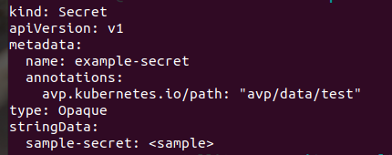

# GitOps-Vault
Manging application secrets is not an easy task in GitOps due to ***git as a single source of truth*** philosophy !   
A lot of efforts have been done to mitigate secret exposure risk, one of which is using [HashiCorp- Vault](https://www.vaultproject.io/).   
Recently, IBM team developed a plugin customized to argocd & vault, it aimed to find a simple way to utilize Vault without having to rely on an operator or custom resource definition.   
- To authenticate vault with argocd, it follows vault approle method:     
     
- The config of the admin side, some of it done as env vars.   
- The Application in the above pic equivalent to the plugin job.     

The rest of this small doc is a demo of the plugin and GitOps, enjoy! :popcorn:    

# Argocd-Vault-Plugin
After you set up vault, you need to update the configuration of your argocd to download & register the used plugin "AVP" either:
- using initContainer to download the plugin 
- building a new image for argocd repo server

in both way, you have to edit the argocd-cm with the default plugin command to run.

## Notes: :loudspeaker:
- `AVP` prefix is super important! :rotating_light::fire:   
   
- if your vault in same cluster, then the address is : `http://SERVICENAME.NAMESPACE.svc:PORT`, otherwise the plugin will not work! :zap:   
   
- set the right permissions and path in the attached policy, otherwise you will get a permission denied issue! :stop_sign:   
didn't take a screenshot :( :grimacing:, so ...   
- make sure of the secret id ttl, if you are not an expert with vault, I recommand leaving it default way!:vertical_traffic_light:   
- using vault http api from inside a pod where vault deployed is super useful way of debugging!:construction:   

# Implementation:

## Preparation
To manage secrets using Vault plugin in GitOps:   

### Updating k8s secret file with:
1. Add annotation with the secret path in vault ( there is another way to do so, you can find it [here](https://github.com/IBM/argocd-vault-plugin#how-it-works))   
2. Replace the secret value with `<KEY-NAME>`, by encoding it this way, the plugin will recognize it and replace it with the real value, EXAMPLE:   

   

You can find it [here](https://github.com/saloyiana/demo)   

### Argocd 
You need to select the plugin while creating the application whether using the UI or YAML:   

   

## Tool's Result:

- creating an application with the plugin in Argocd, after it deployed:   
   

and that is all!! :woman_juggling:   

### Verifying if it is working as expected

Get the secret value in k8s :innocent:   
   

decode it :thinking:   
   

what is the stored value in vault? :raised_eyebrow:   
   

Yeah :smirk:  

### Updating Secret Value in Vault

After Creating a new vesion of the secret in Vault   

Depending on the Sync policy of Argocd application  

   

after syncing, Check the secret    
   

Updated value in Vault   
   

# Quick Compersion Between Secret Management Tools used in GitOps: 

Here is a small compersion between two common secret managment tools that are used in GitOps:

| Sealed Secret | AVP           |
| ------------- | ------------- |
| Deals with Secret Object Only  | Deals with all k8s Object as long as it has avp annotation  |
| Easy setup | Needs more steps  |
| who has access to both git and k8s cluster can see the secret's value | the secret stored in Vault, therefore you need access to it to access secret's vaule 

# References
- Followed: https://itnext.io/argocd-secret-management-with-argocd-vault-plugin-539f104aff05
- https://www.vaultproject.io/docs -> 
  - https://www.vaultproject.io/docs/auth/approle
  - https://www.vaultproject.io/docs/concepts/policies
- https://argoproj.github.io/argo-cd/getting_started/
- https://github.com/IBM/argocd-vault-plugin

